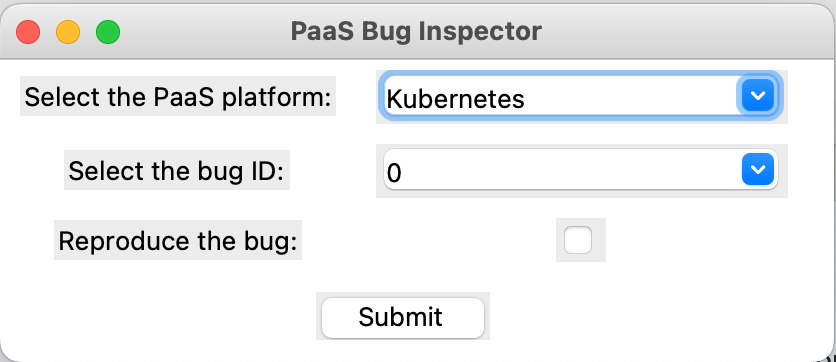

# Bug Instpector Toolkit

### Description
The Bug Inspector Toolkit is a comprehensive tool that contains detailed information on over 50 reproducible 
bugs within the Kubernetes container orchestration tool, which is a leading orchestration platform. 
This project visualizes these reproducible bugs, making it easier for users to understand and address them.

Users can select a bug using its ID and have the option to reproduce the bug in their own cluster. 
Alternatively, they can simply view the reproducibility guide for each respective bug. This toolkit 
provides a valuable resource for developers and system administrators to identify, and understand
bugs in Kubernetes effectively.



### Prerequisites
1. Install tkinter.
2. Setup the Kubernetes Cluster.

### Setup

1. Clone the repository.
    ```
    git clone https://github.com/EmInReLab/BugsInKube.git
    ```

2. Set up the prerequisites.
3. Run the application.
    ```
    python src/ui.py
   ```

### Contributors

Developers:

- [Kabilan Mahathevan](https://github.com/KabilanMA) <br>
- [Tharsha Sivapalarajah](https://github.com/Tharsha-Sivapalarajah) <br>
- [Sivakajan Sivaparan](https://github.com/sivakajan-tech) <br>
